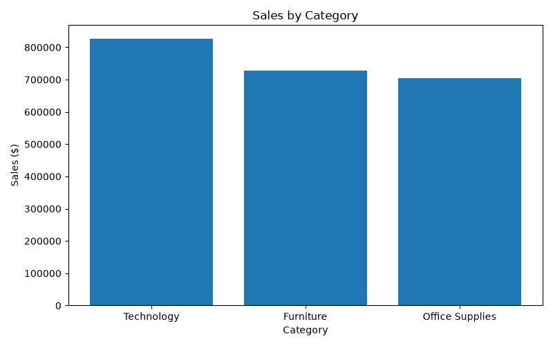
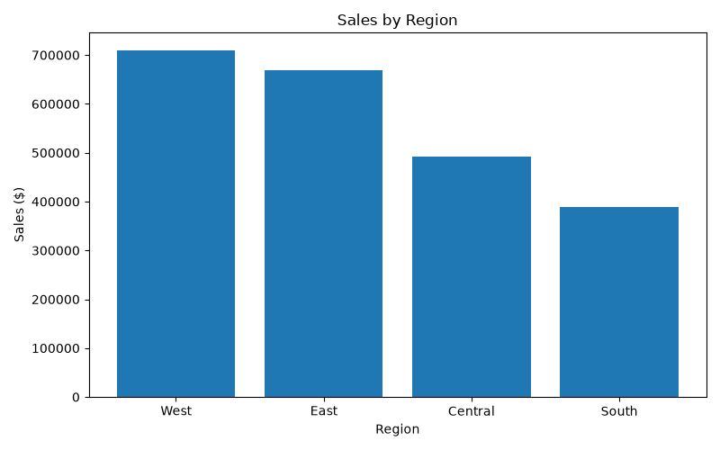
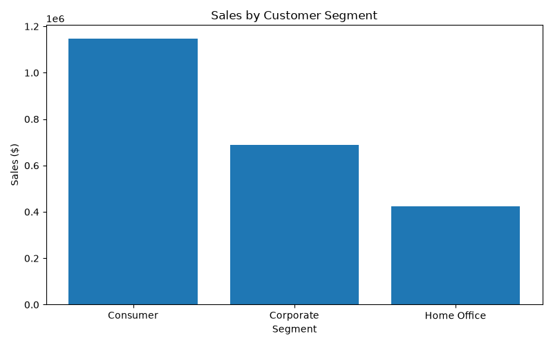
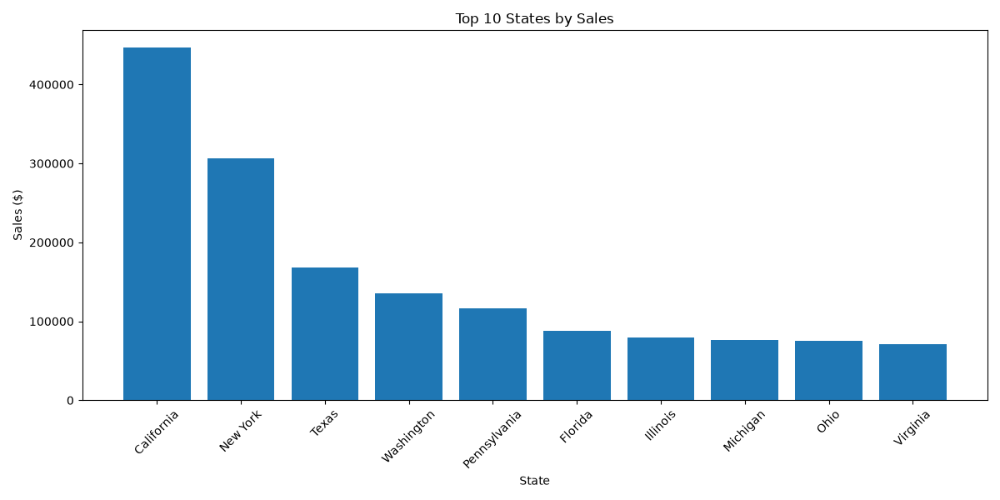
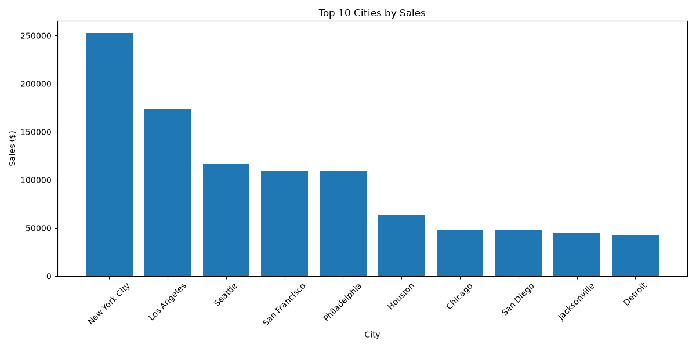
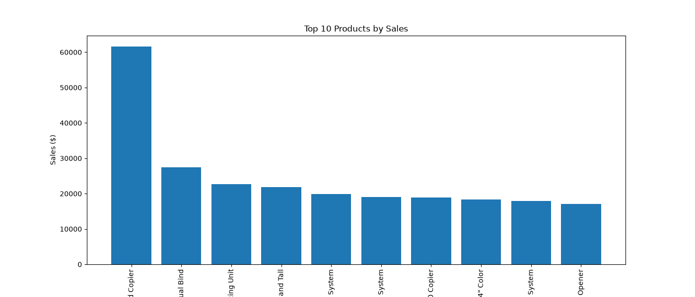

# 📊 Capstone Project 1
## Phase 4 – Data Visualization Report

---

## Project Information

**Project Name:** SuperStore Sales Data Analysis

**Dataset:** SuperStore_Dataset.csv

**Phase:** 4 – Data Visualization

---

# Objective

The objective of this phase is to visually represent the business insights discovered during Exploratory Data Analysis (EDA). Data visualizations help stakeholders quickly identify trends, comparisons, and patterns.

---

# Visualization 1 – Sales by Category

### Observation

- Technology generated the highest sales.
- Furniture ranked second.
- Office Supplies generated the lowest sales.

### Business Insight

Technology is the company's strongest-performing category and contributes the highest revenue.

---

# Visualization 2 – Sales by Region

### Observation

- West region generated the highest sales.
- East region ranked second.
- South generated the lowest sales.

### Business Insight

The company performs exceptionally well in the West region. Sales improvement strategies may be focused on the South region.

---

# Visualization 3 – Sales by Customer Segment

### Observation

- Consumer segment generated the highest sales.
- Corporate ranked second.
- Home Office contributed the least.

### Business Insight

Consumer customers are the primary revenue source and should remain the focus of customer acquisition and retention strategies.

---

# Visualization 4 – Top 10 States by Sales

### Observation

- California generated the highest sales.
- New York ranked second.
- Texas ranked third.

### Business Insight

California and New York are the company's strongest markets and contribute a significant share of total revenue.

---

# Visualization 5 – Top 10 Cities by Sales

### Observation

- New York City generated the highest sales.
- Los Angeles ranked second.
- Seattle, San Francisco, and Philadelphia are also major contributors.

### Business Insight

Large metropolitan cities contribute significantly to overall business growth.

---

# Visualization 6 – Top 10 Products by Sales

### Observation

- Canon imageCLASS 2200 Advanced Copier generated the highest sales.
- Most of the top-selling products belong to Technology and Office Equipment.

### Business Insight

Technology-based products are key revenue drivers and should remain a strategic business priority.

---

# Overall Findings

The visualizations clearly indicate that:

- Technology is the highest-performing category.
- West is the highest-performing region.
- Consumer is the largest customer segment.
- California generates the highest state-wise revenue.
- New York City is the highest revenue-generating city.
- Canon imageCLASS 2200 Advanced Copier is the highest revenue-generating product.

---

# Conclusion

The visualizations successfully transformed numerical analysis into meaningful business insights.

Charts allow stakeholders to understand business performance quickly and support data-driven decision-making.

---

**Status:** ✅ Phase 4 Completed